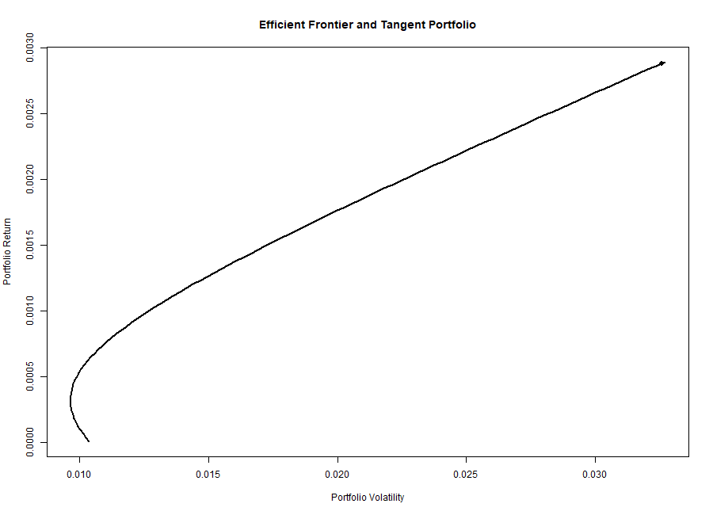
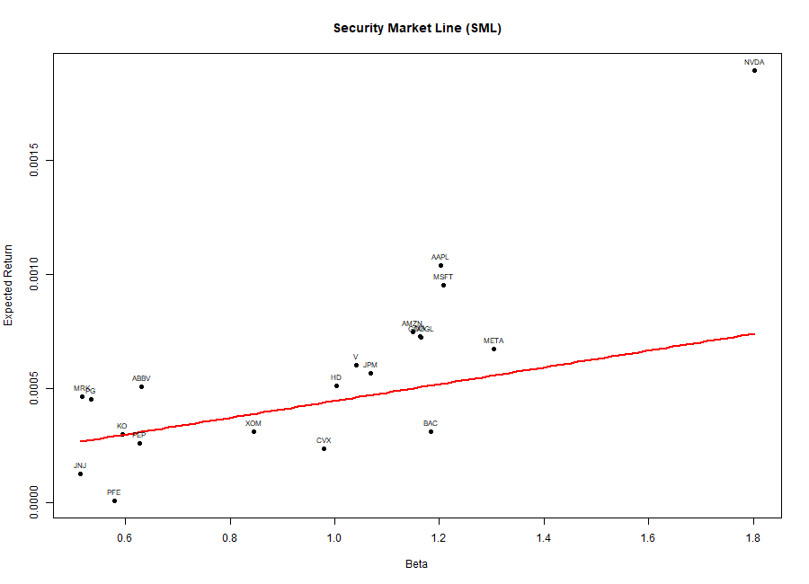

# Portfolio Optimization using Markowitz and CAPM

## Overview

This project implements portfolio optimization techniques using both the **Markowitz Mean-Variance framework** and the **Capital Asset Pricing Model (CAPM)**.

It compares empirical covariance estimation with a factor-based covariance structure derived from CAPM.

---

## Objectives

- Compute daily returns for a cross-section of equities  
- Estimate the Markowitz tangent portfolio  
- Plot the Efficient Frontier  
- Estimate CAPM betas  
- Build the Security Market Line (SML)  
- Construct the CAPM-implied covariance matrix  
- Compare Markowitz and CAPM portfolio allocations  

---

## Project Structure

    scripts/
        01_download_data.R
        02_prepare_returns.R
        03_markowitz.R
        04_capm_beta.R
        05_sml_plot.R
        06_capm_covariance.R
        07_capm_portfolio.R
        08_run_project.R

    data/
    figures/
    report/

---

## Methodology

- **Data**: Daily adjusted prices for S&P500 stocks and index  
- **Model 1**: Markowitz mean-variance optimization  
- **Model 2**: CAPM-based covariance structure  
- **Metric**: Sharpe ratio  
- **Visualization**: Efficient Frontier & SML  

---

## Results

- Markowitz portfolio achieves a higher Sharpe ratio  
- CAPM portfolio is more constrained (single-factor model)  
- Efficient Frontier shows risk-return trade-off  
- SML highlights under/over-valued assets  

---

## Visual Results

### Efficient Frontier

### Security Market Line

---

## How to Run

    source("scripts/08_run_project.R")

---

## Author

**Abdoul Sarr**
